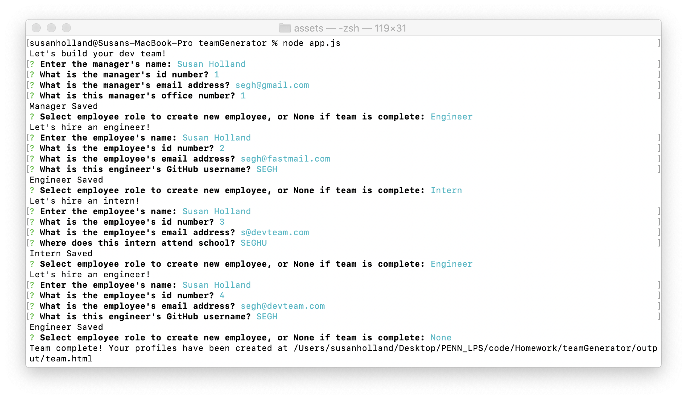
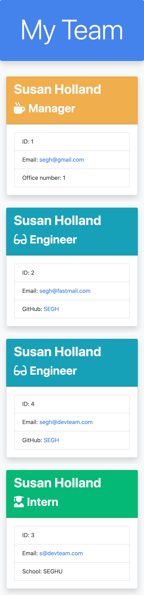
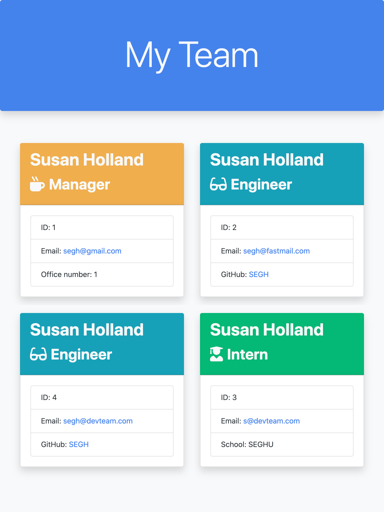
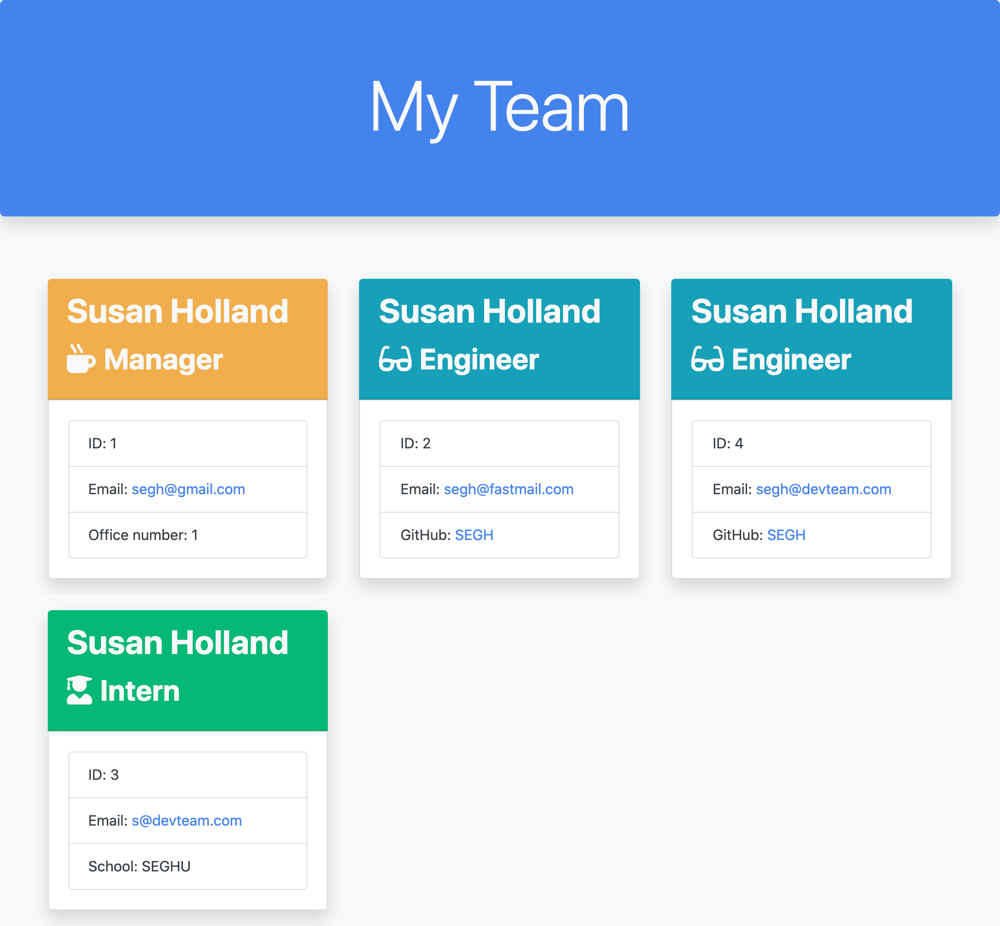

# teamGenerator

  [](http://unlicense.org/)

  ## Description
  This is an application that runs in the CLI and uses the Inquirer npm package to prompt the user for information about their dev team. The user input is pushed as objects to an array that is then used to generate an html page with cards displaying each team member's pertinent information. The html uses Bootstrap to display a responsive user interface once deployed, and each employee's card background color corresponds to their role on the team. The prompt questions and object classes are currently specific to a development team, but with this structure could easily be adapted to another type of team.

  ## Table of Contents
  * [Installation](#installation)
  * [Usage](#usage)
  * [License](#license)
  * [Contributing](#contributing)
  * [Tests](#tests)
  * [Questions](#questions)

  ## Installation
  After cloning this repository, the user should run ```npm install``` in their terminal to install the necessary dependencies for this application.

  ## Usage
  

  * The app will be invoked with the command ```node app.js```
  * The user will first be prompted to answer questions about the manager
  * Then they will be asked to select an employee type, or choose None to exit the prompts
  * Selecting Engineer will first run the general employee questions, followed by the engineer specific questions
  * Selecting Intern will first run the general employee questions, followed by the intern specific questions
  * The app will suggest a default id number for each employee based on how many employees have already been created
  * The app will validate that the user enters a valid email address
  * After completing each employee, the user will continue to be prompted to choose which employee type to add, or select None to exit the prompts and complete the team
  * Once all employees have been added, the app generates an html document that can be deployed where the user chooses

  ### Examples of the responsive interface at 375px, 768px, and 1025px:

  

  ### Watch [this video](https://drive.google.com/file/d/1-GungGT8ukePCfizETxliptdfzWY7MkN/view) to see how it works

  ## License
  Licensed under the [Unlicense](http://unlicense.org/) license.

  ## Contributing
  Please follow the [Contributor Covenant](https://www.contributor-covenant.org) guidelines when contributing to this project.

  ## Tests
  Tests will be a future feature for this application

  ## Questions
  Please contact me with any questions through my GitHub profile [SEGH](https://github.com/SEGH) or [email](mailto:segh@fastmail.com)
